## Documentation of Project1
### Step 1

a. install sudo apache

`sudo apt update`

	Apache2 package installation
    `sudo apt install apache2`
    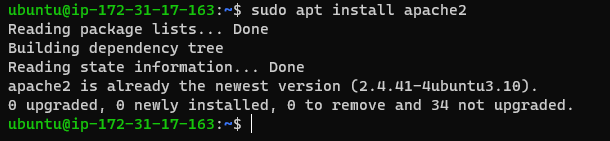
    b. I verified that apache2 is running as a service in my OS
    `sudo systemctl status apache2`
    	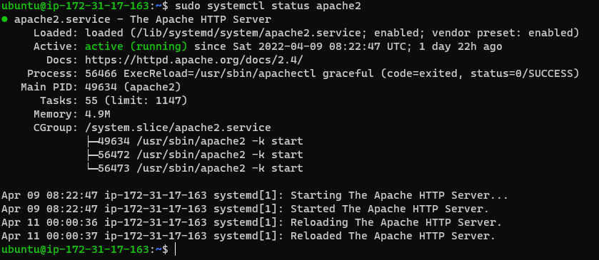
    c. I accessed my server locally in my ubuntu shell
    `
 curl http://localhost:80`
 	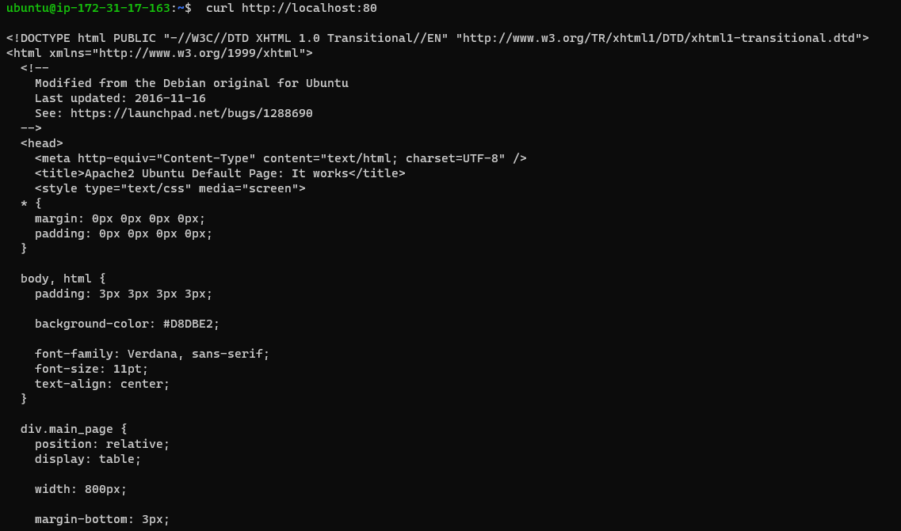
     	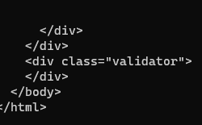

  ### Step 2
  a. I installed mysql server
  	`sudo apt install mysql-server`
      	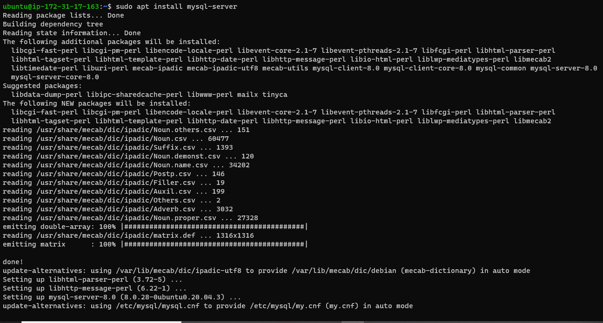
  b. I ran a security script
     `sudo mysql_secure_installation`
     
     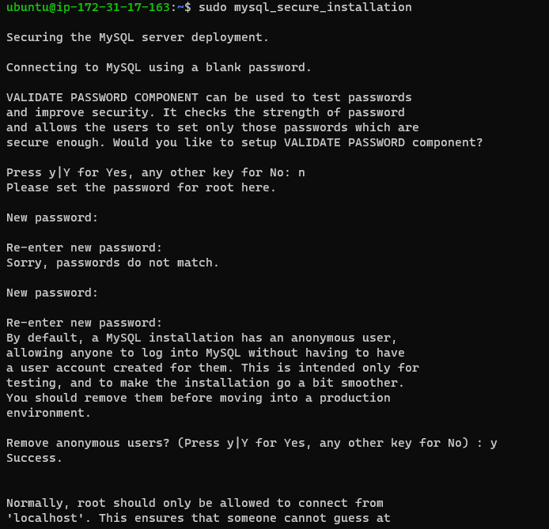
     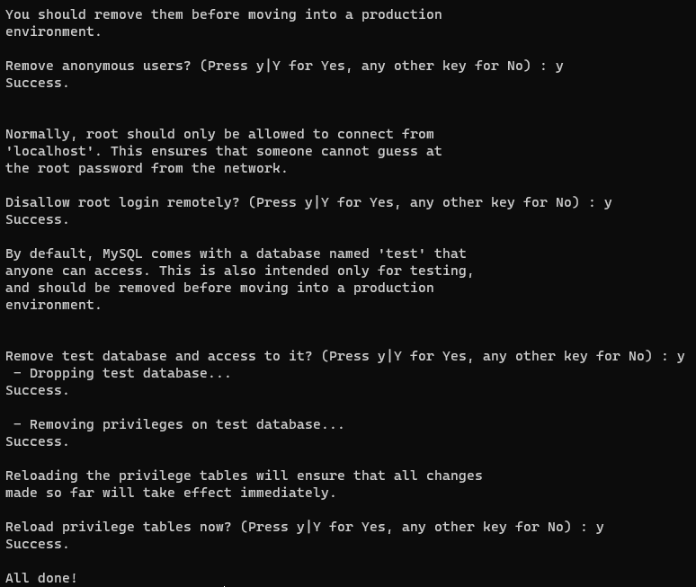
  c. I validated my password login
  d. I checked if I'm able to login to mysql console
     `sudo mysql`
     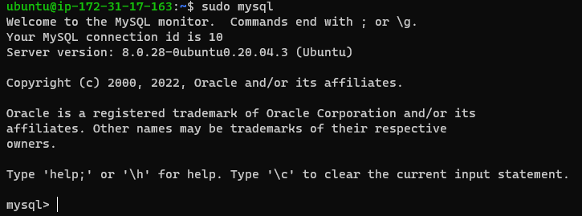
  e. I exit the mysql console
     `mysql> exit`
     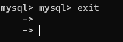

### Step 3
a. I installed the three packages at once
    `sudo apt install php libapache2-mod-php php-mysql`
    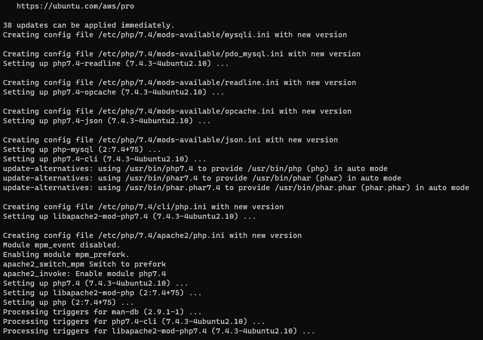
b. I ran this command to confirm the php version
    `php -v`
    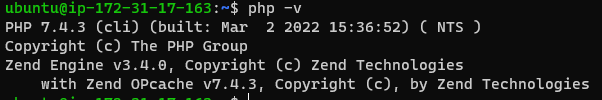

### Step 4
a. I created directory for projectlamp using mkdir
   `sudo mkdir /var/www/projectlamp`
   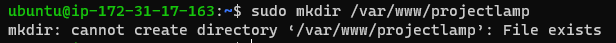
b. I assigned ownership of the directory
     `sudo chown -R $USER:$USER /var/www/projectlamp`
      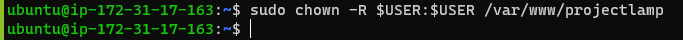

c. I created a new configuration file in Apache's directory
   `sudo vi /etc/apache2/sites-available/projectlamp.conf`
    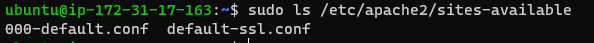
d. I used a2ensite command to enable the virtual host
    `sudo a2ensite projectlamp`
e. I ensured my configuration file doesn't contain syntax error
     `sudo apache2ctl configtest`
     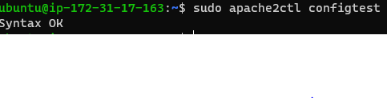
f. I reloaded apache
`sudo systemctl reload apache2`
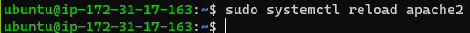

### Step 5
a. I edited the configuration file and changed the order at which it was listed
    `sudo vim /etc/apache2/mods-enabled/dir.conf`
    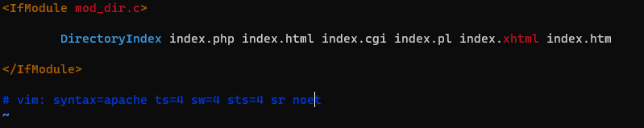
    
b. I reloaded apache for the changes to take effect
       `sudo systemctl reload apache2`
    
c. I created a new file in my custom root web user
    `vim /var/www/projectlamp/index.php`
    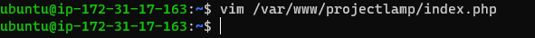
d. I saved and closed the file, then I refreshed the page
     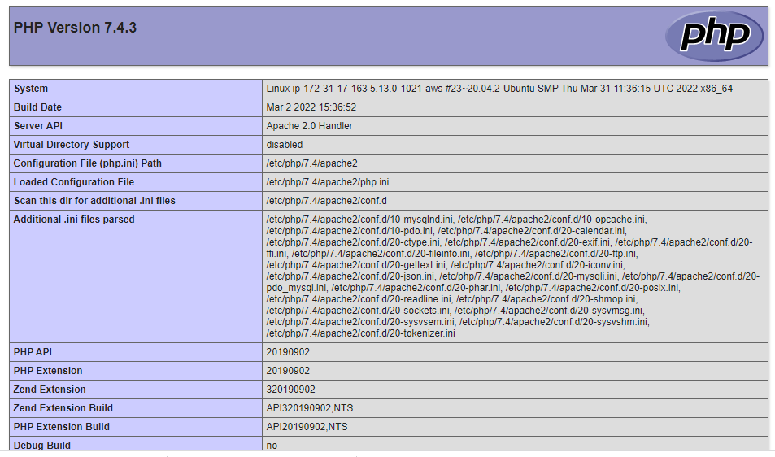
e. I removed the file after checking it on the site
    `sudo rm /var/www/projectlamp/index.php`
    

   

     	

        
